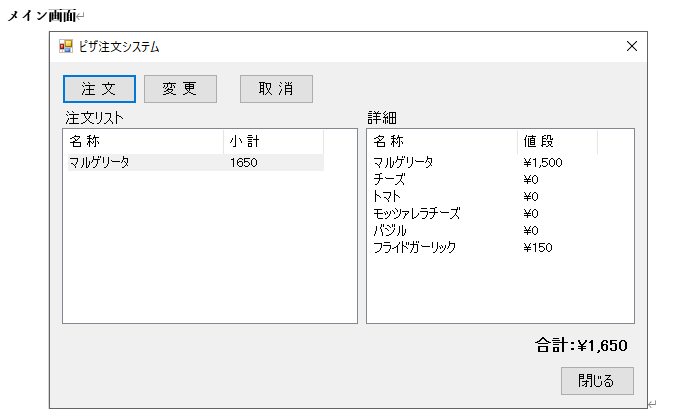
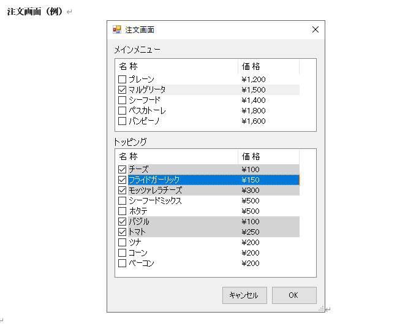

# ピザ注文システム（pizza-order）

ピザの注文管理を行う。ピザは種類ごとに値段とトッピングを持つ。また、デフォルトトッピングがあり、注文追加時には自動で付与・変更不可とする。

## 画面

### メイン画面(MainPage)

- 注文一覧表示
- 各注文の詳細表示
  - ピザおよびトッピング
  - ピザの合計金額
- 各操作ボタン
  - 注文追加ボタン
  - 注文変更ボタン（追加仕様）
  - 取り消しボタン
  - 復元ボタン

### 注文追加モーダル(AddOrderModal)

- ピザ一覧（名称・価格）
- トッピング一覧（名称・価格）
  - 各ピザのデフォルトトッピングはチェック済みとし、変更不可・0円表示とする

## データ

- Pizza
  - id
  - name
  - price
  - defaultToppings:Topping[]
- Topping
  - id
  - name
  - price
- Order
  - id
  - Pizza
  - toppings:Topping[]
  - isCancel

## 操作

- 注文追加(add-order)
- 注文変更(update-order)
- 注文取消(cancel-order)
- 注文復元(restore-order)
